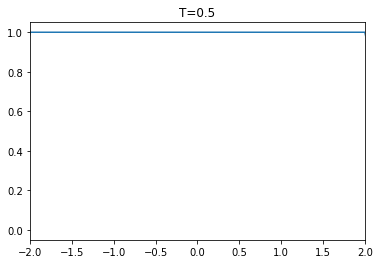
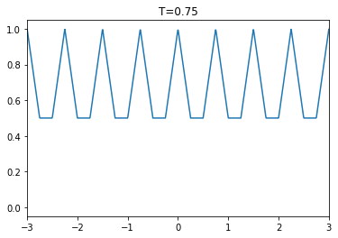
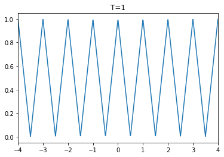
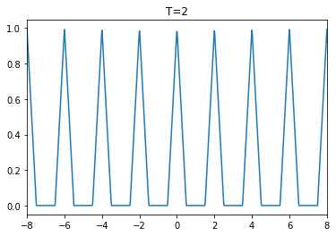
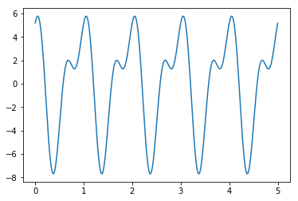

#### Problem 1

(a)记
$$
S=\sum_{n=p}^{q} w^{n}
$$
那么
$$
wS=\sum_{n=p}^{q} w^{n+1}= \sum_{n=p+1}^{q+1} w^{n}
$$
相减得到
$$
\begin{aligned}
(1-w)S&= \sum_{n=p}^{q} w^{n}- \sum_{n=p+1}^{q+1} w^{n}=w^p-w^{q+1}\\
S&=\frac{w^{p}-w^{q+1}}{1-w}
\end{aligned}
$$
接着讨论级数收敛的问题。

如果$p=-\infty,q< \infty​$，那么当$|w|>1​$时，级数收敛，并且
$$
S=\frac{-w^{q+1}}{1-w}=\frac{w^{q+1}}{w-1}
$$
如果$q=\infty,p>-\infty​$，那么当$|w| <1​$时，级数收敛，并且
$$
S=\frac{w^p}{1-w}
$$
如果$q=\infty,p= -\infty$，那么由之前讨论可得，该级数必然发散。

最后将收敛情形总结如下：
$$
\sum_{n=p}^{q} w^{n}=\begin{cases}
\frac{w^{q+1}}{w-1} & |w|>1,p=-\infty,q< \infty \\
\frac{w^p}{1-w} &|w|<1,p>-\infty,q=\infty\\
\frac{w^{p}-w^{q+1}}{1-w} & w\neq 1,-\infty<p,q< \infty
\end{cases}
$$
(b)对上式中取
$$
\begin{aligned}
w&=e^{2\pi in/N}\\
p&=0\\
q&= N-1
\end{aligned}
$$
得到
$$
\begin{aligned}
\sum_{n=0}^{N-1} e^{2 \pi i n / N}
&=\frac{1-e^{2\pi in}}{1-e^{2\pi in/N}}\\
&=0
\end{aligned}
$$
注意$e^{2 \pi i n / N}$为$1$的$N$次单位根，所以上式的几何解释为$1$的$N$次单位根的重心为原点。

(c)对上式中取
$$
\begin{aligned}
w&=e^{2\pi it}\\
p&=-N\\
q&=N
\end{aligned}
$$
得到
$$
\begin{aligned}
\sum_{k=-N}^{N} e^{2 \pi i k t}
&=\frac{e^{-2\pi iNt}-e^{2\pi i(N+1)t}}{1-e^{2\pi it}}\\
&= \frac{(e^{-2\pi iNt}-e^{2\pi i(N+1)t})(1-e^{-2\pi it})}{(1-e^{2\pi it})(1-e^{-2\pi it})}\\
&=\frac{e^{-2\pi iNt}-e^{2\pi i(N+1)t}-e^{-2\pi i(N+1)t}+e^{2\pi iNt}}{1-e^{2\pi it}-e^{-2\pi it}+1}\\
&=\frac{2\cos(2\pi Nt) -2\cos(2\pi (N+1)t)}{2-2\cos (2\pi t)}\\
&=\frac{\cos(2\pi Nt) -\cos(2\pi (N+1)t)}{1-\cos(2\pi t)}\\
&=\frac{2\sin(2\pi t(N+1/2))\sin (\pi t)}{2\sin^2 (\pi t)}\\
&=\frac{\sin(2\pi t(N+1/2))}{\sin(\pi t)}
\end{aligned}
$$


#### Problem 2

(a)直线段必然为两部分的叠加，所以方程为
$$
\Lambda_2 (t) +\Lambda_2 (t-2)
$$
(b)依然由直线段为两部分的叠加，得到方程为
$$
2\Lambda_2(t)+2\Lambda_2(t-3)
$$
(c)区间$[1,3]$为第一个波的左半部分，根据此确定第二个波即可：
$$
6\Lambda_2(t-3)+ 3\Lambda_2(t-5)
$$
(d)类似上一题得到
$$
y_2 \Lambda_{x_2-x_1}(t-x_2)+\frac{y_2}2
\Lambda_{\frac{x_3-x_2}2}\left(t-\frac{x_2+x_3}2\right)
$$
由几何关系，我们得到如下约束
$$
\begin{aligned}
x_2-x_1&=\frac{x_3-x_2}2\\
x_3-3x_2+x_1 &=0
\end{aligned}
$$


#### Problem 3

(a)
$$
\begin{aligned}
g(t+T)
&=\sum_{n=-\infty}^{\infty} f(t+T -n T)\\
&=\sum_{n=-\infty}^{\infty} f\left(t-(n-1)T\right)\\
&=\sum_{m=-\infty}^{\infty} f(t-mT) & m=n-1\\
&=g(t)
\end{aligned}
$$
(b)

```python
import numpy as np
import matplotlib.pyplot as plt

def Lambda(t, a):
    t1 = np.abs(t)
    r = 1 - t1 / a
    index = (t1 > a)
    r[index] = 0
    
    return r

def f(T, n=5):
    #10个周期的点
    t = np.linspace(-n * T, n * T, 1000)
    r = Lambda(t, 1 / 2)
    for i in range(1, n):
        r1 = Lambda(t - i * T, 1 / 2)
        r2 = Lambda(t + i * T, 1 / 2)
        r += r1
        r += r2
    plt.plot(t, r)
    plt.title("T={}".format(T))
    plt.xlim(-(n-1) * T, (n-1) * T)
    plt.show()

T = [1/2, 3/4, 1, 2]
for t in T:
    f(t)
```









(c)如果$f(t)=0$，那么结论成立；否则由$f(t)$在任意一点有定义，累加项$\sum_{n=-\infty}^{\infty} f(t-n T)$必然不收敛，所以
$$
g(t)\neq f(t)
$$


#### Problem 4

符号解释：$\gcd $表示最大公约数，$\text{lcm}$表示最小公倍数。

(a)因为
$$
\begin{aligned}
f(x+1)
&= \sin \left(2\pi m (x+1)\right)
+\sin \left(2\pi n (x+1)\right)\\
&=\sin \left(2\pi m x+2\pi m\right)
+\sin \left(2\pi n x+2\pi n\right)\\
&=\sin \left(2\pi m x \right)
+\sin \left(2\pi n x\right)\\
&=f(x)
\end{aligned}
$$
所以$1$是$f(x)$的周期。接着求最小正周期，假设$T$为周期，那么

$$
\begin{aligned}
f(x+T)
&= \sin \left(2\pi m (x+T)\right)
+\sin \left(2\pi n (x+T)\right)\\
&=\sin \left(2\pi m x+2\pi mT\right)
+\sin \left(2\pi n x+2\pi nT\right)\\
&=\sin \left(2\pi m x \right)
+\sin \left(2\pi n x\right)
\end{aligned}
$$
要使得最后一个等号成立，那么必然要有$mT$为整数，$nT$为整数，所以必然有$T$为有理数，因此不妨设
$$
T=\frac {t_1}{t_2},\gcd (t_1, t_2 )=1
$$
那么
$$
\begin{aligned}
\frac{t_1 m}{t_2},\frac{t_1 n}{t_2}\in \mathbb Z

\end{aligned}
$$
所以必然有
$$
t_2 | m, t_2| n\Rightarrow t_2| \gcd(m,n)
$$
设
$$
{\gcd (m,n)}=t_2{t_3}
$$
那么
$$
T=\frac{t_1t_3}{\gcd(m,n)}\triangleq \frac {k}{\gcd (m,n)} , k\in \mathbb N^+
$$
所以最小正周期为
$$
T=\frac {1}{\gcd (m,n)} 
$$
(b)因为
$$
\begin{aligned}
g(x+rs)
&= \sin \left(2\pi p (x+rs)\right)
+\sin \left(2\pi q (x+rs)\right)\\
&=\sin \left(2\pi p x+2\pi \frac m r rs \right)
+\sin \left(2\pi q x+2\pi \frac n s rs \right)\\
&=\sin \left(2\pi p x+2\pi ms \right)
+\sin \left(2\pi q x+2\pi  n  r\right)\\
&=\sin \left(2\pi p x \right)
+\sin \left(2\pi q x\right)
\end{aligned}
$$
所以$g(x)$是周期函数。接着求最小正周期，假设$T$为周期，那么
$$
\begin{aligned}
g(x+rs)
&= \sin \left(2\pi p (x+T)\right)
+\sin \left(2\pi q (x+T)\right)\\
&=\sin \left(2\pi p x+2\pi \frac m r T \right)
+\sin \left(2\pi q x+2\pi \frac n s T \right)\\

&=\sin \left(2\pi p x \right)
+\sin \left(2\pi q x\right)
\end{aligned}
$$
要使得最后一个等号成立，那么必然要有$mT$为整数，$nT$为整数，所以$T$为有理数，因此不妨设
$$
T=\frac {t_1}{t_2},\gcd (t_1, t_2 )=1
$$
那么
$$
\begin{aligned}
\frac m r T &=\frac{mt_1}{rt_2} \in \mathbb Z\\

\frac n s T &=\frac{nt_1}{st_2} \in \mathbb Z

\end{aligned}
$$
所以
$$
t_2| m ,r| t_1 \\
t_2| n ,s| t_1
$$
因此
$$
t_2 | \gcd (m,n),  \text{lcm}(r,s) |t_1
$$
设
$$
t_1 = a_1 \text{lcm}(r,s),{\gcd (m,n)}=t_2{a_2}
$$
那么
$$
T=\frac{a_1a_2 \text{lcm}(r,s) }{\gcd(m,n)}\triangleq k\frac {\text{lcm}(r,s)}{\gcd (m,n)} , k\in \mathbb N^+
$$
所以最小正周期为
$$
T=\frac {\text{lcm}(r,s)}{\gcd (m,n)}
$$
(c)反证法，假设$f(t)$是周期函数，并且周期为$T$，那么
$$
\begin{aligned}
f(t+T)
&=\cos(t+T)+\cos(\sqrt 2(t+T)) \\
&=\cos(t)+\cos(\sqrt 2 t)\\
&=f(t)
\end{aligned}
$$
令$t=0$，那么
$$
\cos(T)+\cos(\sqrt 2 T) =2
$$
那么必然有
$$
\begin{aligned}
T&=2k_1\pi .k_1\in \mathbb Z\\
\sqrt 2T&=2k_2\pi .k_2\in \mathbb Z\\
\end{aligned}
$$
相除得到
$$
\sqrt 2 =\frac{k_2}{k_1}
$$
这就与$\sqrt 2$是无理数产生了矛盾。

(d)

```python
import numpy as np
import matplotlib.pyplot as plt

#参数
nu1 = 2
nu2 = 1
start = 0
end = 5
step = 0.0001
t = np.arange(start, end, step)
v = 3 * np.cos(2 * np.pi * nu1 * t - 1.3) + 5 * np.cos(2 * np.pi * nu2 * t + 0.5)

plt.plot(t, v)
plt.show()
print(np.max(v))
```



```
5.781103145757635
```


#### Problem 5

(a)
$$
\begin{aligned}
(f^-,g^-)
&=\int_{-\infty}^{\infty} f(-t) \overline{g(-t)} d t\\
&\overset{t=-t}= \int_{-\infty}^{\infty} f(t) \overline{g(t)} d t\\
&=(f,g)
\end{aligned}
$$

(b)
$$
\begin{aligned}
(f,g^-)
&=\int_{-\infty}^{\infty} f(t) \overline{g(-t)} d t\\
&\overset{t=-t}= \int_{-\infty}^{\infty} f(-t) \overline{g(t)} d t\\
&=(f^-,g)
\end{aligned}
$$
(c)
$$
\begin{aligned}
(\tau_af,\tau_ag)
&=\int_{-\infty}^{\infty} f(t-a) \overline{g(t-a)} d t\\
&\overset{t=t-a}= \int_{-\infty}^{\infty} f(t) \overline{g(t)} d t\\
&=(f,g)
\end{aligned}
$$
(d)
$$
\begin{aligned}
(\tau_af,g)
&=\int_{-\infty}^{\infty} f(t-a) \overline{g(t)} d t\\
&\overset{t=t-a}= \int_{-\infty}^{\infty} f(t) \overline{g(t+a)} d t\\
&=(f,\tau_{-a}g)
\end{aligned}
$$
(e)
$$
\begin{aligned}
(\tau_af,\tau_bg)
&=\int_{-\infty}^{\infty} f(t-a) \overline{g(t-b)} d t\\
&\overset{t=t-a}= \int_{-\infty}^{\infty} f(t) \overline{g(t+a-b)} d t\\
&=(f,\tau_{b-a} g)\\
&\overset{t=t-b}  = \int_{-\infty}^{\infty} f(t+b-a) \overline{g(t)} d t\\
&=(\tau_{a-b}f, g)
\end{aligned}
$$
(f)重新计算之前结论。

首先如果$h(x)$周期为$1$，那么
$$
\int_{a}^{a+1} h(t) d t=\int_{0}^{1} h(t) d t
$$
(a)
$$
\begin{aligned}
(f^-,g^-)
&=\int_{0}^{1} f(-t) \overline{g(-t)} d t\\
&\overset{t=-t}= \int_{-1}^{0} f(t) \overline{g(t)} d t\\
&= \int_{0}^{1} f(t) \overline{g(t)} d t &由周期性\\
&=(f,g)
\end{aligned}
$$

(b)
$$
\begin{aligned}
(f,g^-)
&=\int_{0}^{1} f(t) \overline{g(-t)} d t\\
&\overset{t=-t}= \int_{-1}^{0} f(-t) \overline{g(t)} d t\\
&= \int_{0}^{1} f(-t) \overline{g(t)} d t &由周期性\\
&=(f^-,g)
\end{aligned}
$$
(c)
$$
\begin{aligned}
(\tau_af,\tau_ag)
&=\int_{0}^{1}f(t-a) \overline{g(t-a)} d t\\
&\overset{t=t-a}= \int_{-a}^{-a+1} f(t) \overline{g(t)} d t\\
&= \int_{0}^{1} f(t) \overline{g(t)} d t &由周期性\\
&=(f,g)
\end{aligned}
$$
(d)
$$
\begin{aligned}
(\tau_af,g)
&=\int_{0}^{1} f(t-a) \overline{g(t)} d t\\
&\overset{t=t-a}= \int_{-a}^{1-a} f(t) \overline{g(t+a)} d t\\
&= \int_{0}^{1} f(t) \overline{g(t+a)} d t\\
&=(f,\tau_{-a}g)
\end{aligned}
$$
(e)
$$
\begin{aligned}
(\tau_af,\tau_bg)
&=\int_{0}^{1} f(t-a) \overline{g(t-b)} d t\\
&\overset{t=t-a}= \int_{-a}^{-a+1}f(t) \overline{g(t+a-b)} d t\\
&= \int_{0}^{1}f(t) \overline{g(t+a-b)} d t\\
&=(f,\tau_{b-a} g)\\
&\overset{t=t-b}  = \int_{-b}^{1-b} f(t+b-a) \overline{g(t)} d t\\
& = \int_{0}^{1} f(t+b-a) \overline{g(t)} d t\\
&=(\tau_{a-b}f, g)
\end{aligned}
$$


#### Problem 6

(a)首先验证收敛性。

假设
$$
|c_n|\le c,n\in \mathbb N^+
$$
那么
$$
\begin{aligned}
\left|c_{0}+2 \sum_{n=1}^{\infty} c_{n} r^{n} e^{i n \theta}\right|
&\le \left|c_0\right| +2\sum_{n=1}^{\infty}\left|c_n\right|\left| e^{i n \theta}\right|r^n\\
&\le \left|c_0\right| +2c\sum_{n=1}^{\infty}r^n
\end{aligned}
$$
因为$0\le r<1​$，所以上述级数绝对收敛，因此有定义。

记
$$
h(r,\theta) = c_{0}+2 \sum_{n=1}^{\infty} c_{n} r^{n} e^{i n \theta}
$$
那么
$$
\begin{aligned}
\frac{\partial h}{\partial r}
&=2 \sum_{n=1}^{\infty}n c_{n} r^{n-1} e^{i n \theta}\\
\frac{\partial h}{\partial \theta}
&=2i \sum_{n=1}^{\infty}nc_{n} r^{n} e^{i n \theta}\\

\frac{\partial^2 h}{\partial r^2}
&=2 \sum_{n=1}^{\infty}n(n-1) c_{n} r^{n-2} e^{i n \theta}\\

\frac{\partial^2 h}{\partial \theta^2}
&=-2 \sum_{n=1}^{\infty}n^2c_{n} r^{n} e^{i n \theta}\\
\end{aligned}
$$
所以
$$
\begin{aligned}
\frac{\partial^{2} h}{\partial r^{2}}+
\frac{1}{r} \frac{\partial h}{\partial r}+\frac{1}{r^{2}} \frac{\partial^{2} h}{\partial \theta^{2}}
&=2 \sum_{n=1}^{\infty}n(n-1) c_{n} r^{n-2} e^{i n \theta} +2 \sum_{n=1}^{\infty}n c_{n} r^{n-2} e^{i n \theta} -2 \sum_{n=1}^{\infty}n^2c_{n} r^{n-2} e^{i n \theta}\\
&=0
\end{aligned}
$$
所以
$$
\frac{\partial^{2} U}{\partial r^{2}}+\frac{1}{r} \frac{\partial U}{\partial r}+\frac{1}{r^{2}} \frac{\partial^{2} U}{\partial \theta^{2}} =\text{Re}
\left\{\frac{\partial^{2} h}{\partial r^{2}}+
\frac{1}{r} \frac{\partial h}{\partial r}+\frac{1}{r^{2}} \frac{\partial^{2} h}{\partial \theta^{2}}\right\}=0
$$
(b)注意$f(\theta)$为实数，所以
$$
c_{-n}=\overline {c_n},c_0是实数
$$
那么
$$
\begin{aligned}
f(\theta)&=\sum_{n=-\infty}^{\infty} c_{n} e^{i n \theta}\\
&=c_0 +\sum_{n=1}^{\infty} c_{n} e^{i n \theta}
+\sum_{n=-\infty}^{-1} c_{n} e^{i n \theta}\\
&=c_0 +\sum_{n=1}^{\infty} c_{n} e^{i n \theta}
+\sum_{n=1}^{\infty} c_{-n} e^{-i n \theta}\\
&=c_0 +\sum_{n=1}^{\infty}\left( c_{n} e^{i n \theta} +\overline {c_n} e^{-i n \theta} \right)\\
&=c_0 +\sum_{n=1}^{\infty}\left({ c_{n} e^{i n \theta} +\overline{{c_n} e^{i n \theta}}} \right)\\
&=\operatorname{Re}\left\{c_{0}+2 \sum_{n=1}^{\infty} c_{n} e^{i n \theta}\right\}\\
&=u(1,\theta)
\end{aligned}
$$
(c)由傅里叶系数的计算公式可得
$$
c_n = \frac 1{2\pi}\int_{0}^{2\pi } e^{- i n t} f(t) d t
$$
带入$u(r,\theta )​$的计算公式得到
$$
\begin{aligned}
u(r, \theta)
&=\text{Re}\left\{c_{0}+2 \sum_{n=1}^{\infty} c_{n} r^{n} e^{i n \theta}\right\} \\
&=\text{Re}\left\{ \frac 1{2\pi}\int_{0}^{2\pi } f(t) d t
+\frac 1{2\pi}\sum_{n=1}^{\infty}2   \int_{0}^{2\pi }  r^{n} e^{i n \theta}  e^{-i n t}f(t) d t\right\}\\
&=\text{Re}\left\{\frac 1{2\pi}\int_{0}^{2\pi } f(t) d t+\frac 1{2\pi}2   \int_{0}^{2\pi } \sum_{n=1}^{\infty} r^{n} e^{i n (\theta-t)}  f(t) d t\right\}\\
&=\frac 1{2\pi}\int_{0}^{2\pi } f(t) d t+\frac 1{2\pi}   \int_{0}^{2\pi } \sum_{n=1}^{\infty} r^{n} e^{i n (\theta-t)}  f(t) d t
+\frac 1{2\pi} \int_{0}^{2\pi } \sum_{n=1}^{\infty} r^{n} e^{-i n (\theta-t)}  f(t) d t &由共轭复数的性质\\
&=\frac 1{2\pi}\int_{0}^{2\pi } f(t) d t+\frac 1{2\pi}  \int_{0}^{2\pi } \frac{re^{i(\theta -t)}}{ 1-re^{i(\theta -t)}} f(t)dt
+\frac 1{2\pi}  \int_{0}^{2\pi } \frac{re^{-i(\theta -t)}}{ 1-re^{-i(\theta -t)}} f(t)dt\\
&=\frac 1{2\pi}\int_{0}^{2\pi } f(t) d t+\frac 1{2\pi}  \int_{0}^{2\pi } 
\left(\frac{re^{i(\theta -t)}}{ 1-re^{i(\theta -t)}}+ \frac{re^{-i(\theta -t)}}{ 1-re^{-i(\theta -t)}}   \right)f(t)dt\\
&=\frac 1{2\pi}\int_{0}^{2\pi } f(t) d t+\frac 1{2\pi}  \int_{0}^{2\pi } 
\left(\frac{re^{i(\theta -t)}( 1-re^{-i(\theta -t)})+re^{-i(\theta -t)}(1-re^{i(\theta -t)})}
{ ( 1-re^{-i(\theta -t)})(1-re^{i(\theta -t)})}   \right)f(t)dt\\
&=\frac 1{2\pi}\int_{0}^{2\pi } f(t) d t+\frac 1{2\pi}  \int_{0}^{2\pi } 
\left(\frac{re^{i(\theta -t)}+re^{-i(\theta -t)} -2r^2}
{ 1-re^{-i(\theta -t)}-re^{i(\theta -t)} +r^2}   \right)f(t)dt\\
&=\frac 1{2\pi}  \int_{0}^{2\pi } 
\left(1+\frac{2r \cos(\theta -t) -2r^2}
{ 1-2r\cos(\theta-t) +r^2}   \right)f(t)dt\\
&=\frac 1{2\pi}  \int_{0}^{2\pi } 
\frac{1-r^2}
{ 1-2r\cos(\theta-t) +r^2}   f(t)dt\\
&=\frac{1}{2 \pi} \int_{0}^{2 \pi} f(\phi) P(r, \theta-\phi) d \phi
\end{aligned}
$$
(d)回顾之前的计算过程，我们有
$$
P(r,\theta- t) =\text{Re}\left\{c_{0}+2 \sum_{n=1}^{\infty} r^{n} e^{i n (\theta-t)}\right\}
$$
所以
$$
P(r,\theta) =\text{Re}\left\{c_{0}+2 \sum_{n=1}^{\infty} r^{n} e^{i n \theta}\right\}
$$
由(a)可知$P(r,\theta)$是简谐函数。

