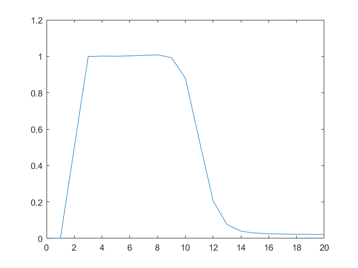
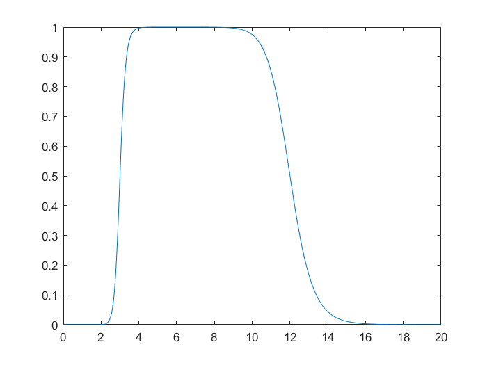

#### Problem 1

(a)注意到
$$
\mathcal F \Lambda = \text{sinc}^2
$$
所以
$$
\begin{aligned}
\int_{-\infty}^{\infty} \operatorname{sinc}^{4}(t) d t
&= \int_{-\infty}^{\infty}  (\mathcal F \Lambda (t))^2   dt\\
&= \int_{-\infty}^{\infty}  \Lambda ^2 (s)  ds\\
&= 2 \int_{0}^{1}  (1-s)^2 ds\\
&=\frac 2 3
\end{aligned}
$$
(b)设
$$
g(t)=e^{-a|t|}
$$
那么
$$
\mathcal F g(s) =\frac{2 a}{a^{2}+4 \pi^{2} s^{2}}
$$
如果$a=1$，那么
$$
\mathcal F g(s) =\frac{2}{1+4 \pi^{2} s^{2}}
$$
另一方面，我们有
$$
\mathcal F\Pi (s) =\operatorname{sinc}(s)
$$
设
$$
f(t)= \Pi \left(\frac t 2 \right)
$$
所以
$$
\mathcal F f(s) =2\operatorname{sinc}(2s)
$$
因此
$$
\begin{aligned}
\int_{-\infty}^{\infty} \frac{2}{1+(2 \pi t)^{2}} \operatorname{sinc}(2 t) d t
&=\frac 12 \int_{-\infty}^{\infty}\mathcal F g(t) \mathcal F f(t) dt\\
&=\frac 12 \int_{-\infty}^{\infty}\mathcal F g(t)\overline{\mathcal F f(t)} dt\\
&=\frac 12 \int_{-\infty}^{\infty}g(s)\overline{f(s)} ds\\
&=\frac 12  \int_{-1}^{1} e^{-|s|} ds\\
&=\int_{0}^{1} e^{-s} ds\\
&=1-e^{-1}
\end{aligned}
$$
(c)注意到
$$
(\mathcal F \Lambda ^{(1)})(s) = (2\pi i s) \mathcal F \Lambda(s)
$$
所以
$$
\begin{aligned}
\int_{-\infty}^{\infty} t^{2} \operatorname{sinc}^{4}(t) d t
&= \frac{1}{4\pi^2} \int_{-\infty}^{\infty}  |(\mathcal F \Lambda ^{(1)})(t) |^2 dt\\
&=\frac{1}{4\pi^2} \int_{-\infty}^{\infty}   \left|\Lambda ^{(1)}(s)\right|^2 ds\\
&=\frac{1}{4\pi^2} \times 2\times \int_{0}^{1}   1ds\\
&=\frac 1 {2\pi^2}
\end{aligned}
$$


#### Problem 2

(a)该函数为
$$
f(t) = \text{sign}(t)\times  \left(1 - \Pi\left(\frac t 2\right)\right)
$$
取傅里叶变换得到
$$
\begin{aligned}
\mathcal F f(s)
&= \mathcal  F  \text{sign}(t) *  \mathcal F  \left(1 - \Pi\left(\frac t 2\right)\right)\\
&= \frac{1}{\pi i t}  * \left(\delta(t) -2 \text{sinc} (2t)\right)
\end{aligned}
$$


设
$$
H(x)=\left\{\begin{array}{ll}{0} & {x \leq 0} \\ {1} & {x>0}\end{array}\right.
$$
那么
$$
\begin{aligned}
g(t) &= H (t-1)  \\
f(t)  &= g(t)-g^{-}(t)
\end{aligned}
$$
所以
$$
\begin{aligned}
\mathcal F g(s)
&= e^{-2\pi is} \mathcal F H(s)\\
&= e^{-2\pi is} \frac{1}{2}\left(\delta(s)+\frac{1}{\pi i s}\right) \\
\mathcal F g^{-}(s)
&= (\mathcal F g(s))^{-} \\
&= e^{2\pi is} \frac{1}{2}\left(\delta(-s)+\frac{1}{\pi i (-s)}\right)\\
&=e^{2\pi is} \frac{1}{2}\left(\delta(s)-\frac{1}{\pi i s}\right)\\
\mathcal F f(s)
&= \mathcal F g(s) - \mathcal F g^{-}(s)\\
&=\frac 1 2 \delta(s)\left(e^{-2\pi is}-e^{2\pi is} \right) 
+\frac 1 2 \frac{1}{\pi i s} \left(e^{2\pi is}+e^{-2\pi is} \right)\\
&= \frac 1 2 \delta(s)(-2i)\sin(2\pi s)+\frac 1 2 \frac{1}{\pi i s}
 2\cos (2\pi s)\\
&=\frac{\cos (2\pi s)}{\pi i s}
\end{aligned}
$$
(b)注意到
$$
\sin (2 \pi|t|)= \frac 1 {2i} \left( e^{2\pi i|t|}-e^{-2\pi i|t|}\right)
$$
设
$$
g(t)=e^{-a|t|}
$$
那么
$$
\mathcal F g(s) =\frac{2 a}{a^{2}+4 \pi^{2} s^{2}}
$$


所以
$$
\begin{aligned}
\mathcal F f (s)
&=\frac 1 {2i}  \left(\frac{2 (-2\pi i)}{-4\pi^2+4 \pi^{2} s^{2}}
-\frac{2 (2\pi i)}{-4\pi^2+4 \pi^{2} s^{2}}
\right)\\
&=\frac{-4\pi}{4\pi^2 (s^2 -1)}\\
&=\frac{1}{\pi (1-s^2)}
\end{aligned}
$$


#### Problem 3

(a)因为
$$
\mathcal F\cos (2 \pi \nu t) =\frac{1}{2}(\delta(s-\nu)+\delta(s+\nu))
$$
注意时域的滤波等价于频域的乘积，所以频域的输出结果为
$$
\frac{1}{2}(\delta(s-\nu)+\delta(s+\nu)) H(s)
$$
利用
$$
g(x) \delta_{a}=g(a) \delta_{a}
$$
取傅里叶逆变换可得
$$
\begin{aligned}
\mathcal F^{-1}\left(\frac{1}{2}(\delta(s-\nu)+\delta(s+\nu)) H(s)\right)
&=\mathcal F^{-1}\left(\frac{1}{2}(\delta(s-\nu)+\delta(s+\nu)) H(s)\right)\\
&=\frac 1 2 \left( \mathcal F^{-1}  \delta(s-\nu)H(\nu) 
+ \mathcal F^{-1}  \delta(s+\nu)H(-\nu)
\right)\\
&= H(\nu)\mathcal F^{-1}\left(\frac{1}{2}(\delta(s-\nu)+\delta(s+\nu))\right)\\
&=  H(\nu)\cos (2 \pi \nu t)
\end{aligned}
$$
(b)算法的思路是利用
$$
|H(\nu)| = \max_t | H(\nu)\cos (2 \pi \nu t)|
$$

```matlab
%(b)
Nu = 0 : 20;
res = zeros(1, 21);

for nu = 1 : 21
    resolution = 0.001; 
    t = 0:resolution:10;
    input = cos(2*pi*nu*t);
    output = identme(input, resolution);
    res(nu) = max(output);
end
figure(1);
plot(Nu, res);
```



(c)

```matlab
%(c)
s = 0: 0.01: 20;
H = transferfcn(s);
figure(2)
plot(s, H);
```




#### Problem 4

$$
\begin{aligned}
\mathcal F f(s)
&=\mathcal F \left(1+\Lambda(3 t) * \text{III}_{1 / 3}(t)\right)\\
&=\delta(s) +\frac 13 \text{sinc}^2 \left(\frac s 3 \right) \times 3\text{III}_{3}(s)\\
&=\delta(s) +\sum_{k=-\infty}^{\infty} \text{sinc}^2 \left(k \right) 
\delta(s-3k)
\end{aligned}
$$

注意到我们有
$$
\text{sinc}^2 \left(k \right) =\begin{cases}
1 & k=0\\
0 &  其他
\end{cases}
$$
所以
$$
\begin{aligned}
\mathcal F f(s)
&=2\delta(s) 
\end{aligned}
$$
取逆变换得到
$$
f(s)=2
$$


#### Problem 5

如果在整周期的时刻看电风扇，那么其图像不变；特别的，如果该电风扇有三个叶子，那么在$\frac 13$周期的整数倍看电风扇，其图像依然不变。