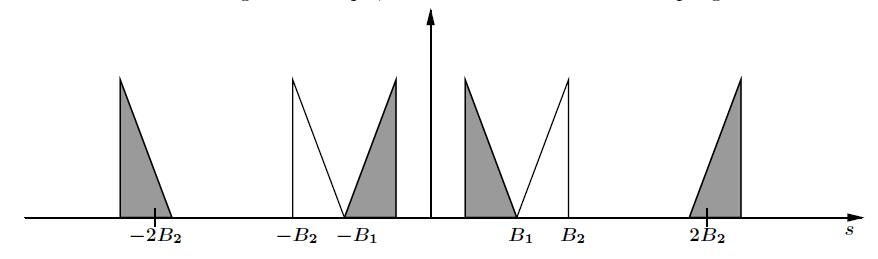
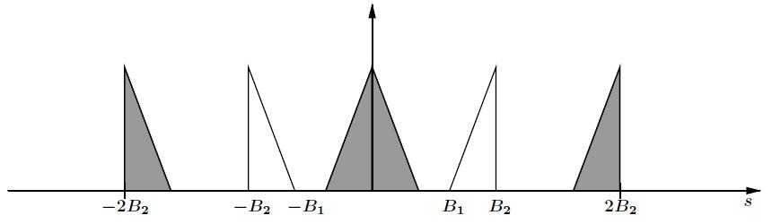
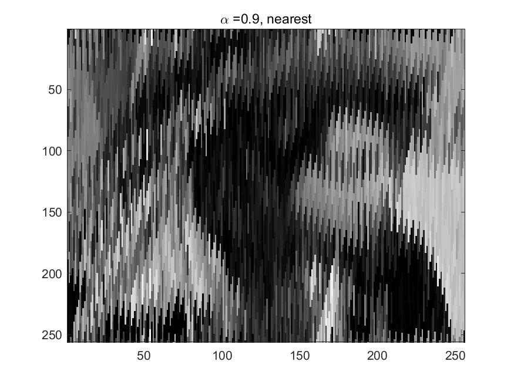
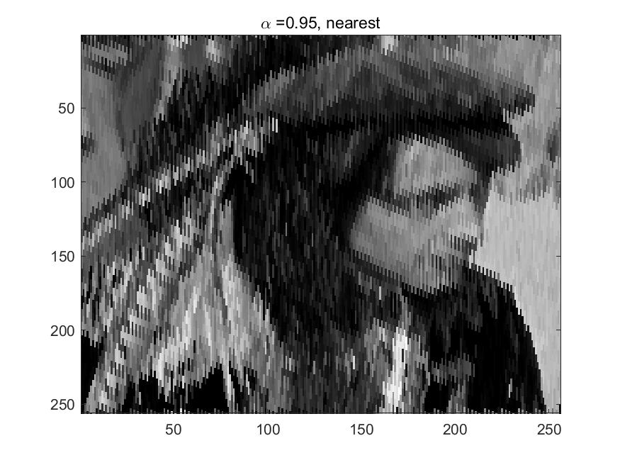
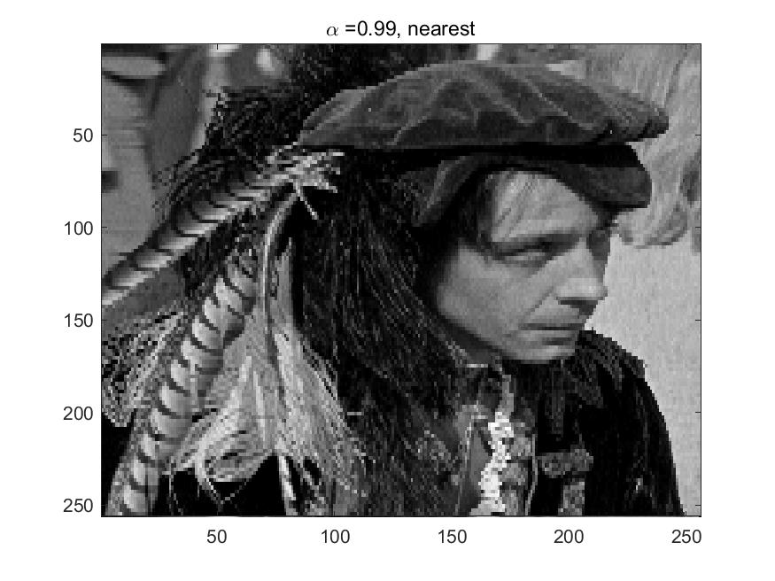
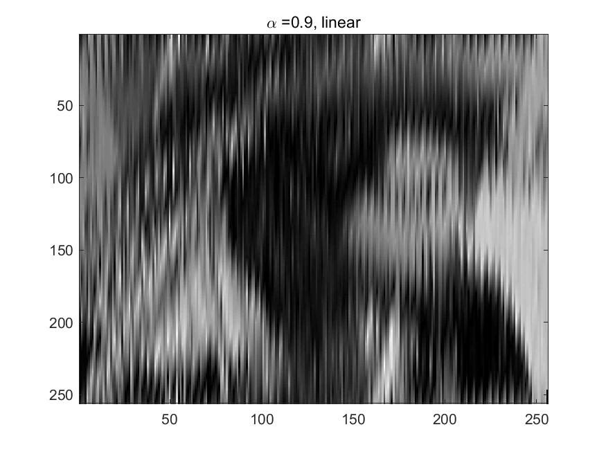

#### Problem 1

只要没有重合即可，考虑如下两种极限情形：





所以结果为
$$
 B_2<s <2B_1
$$


#### Problem 2

(a)利用$\text{III}$函数对原式进行化简可得
$$
\sum_{k=-\infty}^{\infty} T p(t-k T)
=T p(t) *  \text{III}_T (t)
$$
取傅里叶变换可得
$$
\begin{aligned}
\mathcal F g(s)
&= \mathcal Ff(s) *
\left(T\mathcal Fp(s)  \frac 1 T   \text{III}_{\frac 1T} (t) \right)\\
&=\mathcal Ff(s) *
\left(  \mathcal Fp(s) \text{ III}_{\frac 1T} (s) \right)\\
&= \mathcal Ff(s) *
\left( \sum_{k=-\infty}^{\infty}  \mathcal Fp(s) \delta \left(s- \frac k T \right) \right)\\
&= \mathcal Ff(s) *
\left( \sum_{k=-\infty}^{\infty}  \mathcal Fp \left( \frac k T \right)  \delta \left(s- \frac k T \right) \right)\\
&= \sum_{k=-\infty}^{\infty}  \mathcal Fp \left( \frac k T \right)  
\left(\mathcal Ff(s) *  \delta \left(s- \frac k T \right)\right) \\
&=\sum_{k=-\infty}^{\infty}   \mathcal Fp \left( \frac k T \right)   \mathcal Ff\left( s-\frac k T \right)
\end{aligned}
$$
取逆变换可得
$$
g(s)=\sum_{k=-\infty}^{\infty}   \mathcal Fp \left( \frac k T \right)  f\left( s-\frac k T \right)
$$
对比采样定理
$$
f(t)=\sum_{k=-\infty}^{\infty} f\left(\frac{k}{p}\right) \operatorname{sinc} p\left(t-\frac{k}{p}\right)
$$
只要利用第一个式子求解出第二个式子的系数即可，其条件为采样间隔大于带宽，即$\frac 1 T >2 B$


#### Problem 3

因为
$$
f(x) = \frac{1}{2} \left( e^{-2\pi ix} + e^{2\pi ix}\right)
$$
取傅里叶变换可得
$$
\mathcal F f(s) = \frac{1}{2}\left(\delta (s-1)+\delta(s+1)\right)
$$
按$\frac 2 3$采样即使用$\text{III}_{\frac 2 3}$，所以
$$
\begin{aligned}
\mathcal F f(s)  * \text{III}_{\frac 2 3}
&= \frac{1}{2}\left(\delta(s-1)+\delta(s+1)\right)  * \sum_{i=1}^\infty  
\delta \left(x- \frac 2 3k \right) \\
&= \frac 12 \sum_{i=1}^\infty  
\delta \left(s- \frac 2 3k -1 \right) +\frac 12 \sum_{i=1}^\infty  
\delta \left(s- \frac 2 3k +1\right)
\end{aligned}
$$
按照$\frac 2 3 $赫兹截断，那么
$$
\begin{aligned}
\Pi_{\frac 23 } \left(\mathcal F f(s)  * \text{III}_{\frac 2 3} \right)
&=\frac 12
\left(\delta \left(s -\frac 13 \right)+ \delta \left(s +\frac 13 \right) \right)+
\frac 12\left(\delta \left(s -\frac 13 \right)+ \delta \left(s +\frac 13 \right) \right)\\
&=\delta \left(s -\frac 13 \right)+ \delta \left(s +\frac 13 \right)  
\end{aligned}
$$
取傅里叶逆变换可得
$$
e^{-2\pi it \frac 13 } +  e^{2\pi it \frac 13 } =2\cos \left(\frac 2 3 \pi t  \right)
$$


#### Problem 4

由采样定理，我们得到
$$
g(t)=\sum_{k=-\infty}^{\infty} g\left(t_{k}\right) \operatorname{sinc} p'\left(t-t_{k}\right)
$$
其中
$$
p' \ge p
$$
对上式积分
$$
\begin{aligned}
\int_{-\infty}^{\infty} g(t) d t
&= \int_{-\infty}^{\infty} \sum_{k=-\infty}^{\infty} g\left(t_{k}\right) \operatorname{sinc} p'\left(t-t_{k}\right)d t \\
&= \sum_{k=-\infty}^{\infty} g\left(t_{k}\right)
\int_{-\infty}^{\infty} 
\operatorname{sinc} p'\left(t-t_{k}\right)d t 
\end{aligned}
$$
现在计算
$$
\int_{-\infty}^{\infty} 
\operatorname{sinc} p'\left(t-t_{k}\right)d t
$$
我们有
$$
\begin{aligned}
\mathcal F
\operatorname{sinc} p'\left(t-t_{k}\right)
&=   e^{-2\pi i p't_k  s} \mathcal F\operatorname{sinc} p' t \\
&= e^{-2\pi i p't_k  s}  \frac 1 {p'} \Pi_{{p'}  } (s)
\end{aligned}
$$
注意到上述积分为傅里叶变换在$s=0$处的值，所以
$$
\int_{-\infty}^{\infty} 
\operatorname{sinc} p'\left(t-t_{k}\right)d t = \frac 1 {p'}
$$
因此
$$
\begin{aligned}
\int_{-\infty}^{\infty} g(t) d t
&= \sum_{k=-\infty}^{\infty} g\left(t_{k}\right)
\int_{-\infty}^{\infty} 
\operatorname{sinc} p'\left(t-t_{k}\right)d t \\
&=\frac 1 {p'}\sum_{k=-\infty}^{\infty}  g\left(t_{k}\right)
\end{aligned}
$$


#### Problem 5

```matlab
% (a)
d1 = imread("man.gif");
%转换类型
%data = im2double(data);
d2 = d1(:);
d3 = double(d2);
d4 = d3 / max(d3);
n = length(d4);

% (b)
x = fft(d4);
l = length(x);
% 中心化
x_center = [x(l/2 + 1: end); x(1: l/2)];
plot([-l/2: l / 2 - 1], abs(x_center))

% (c)
E_total = norm(x_center) ^ 2;
E_partial = zeros(1, l / 2);
E_partial(1) = abs(x(1)) ^ 2;
for i = 2: (l / 2 - 1)
    E_partial(i) = E_partial(i - 1) + 2 * abs(x(i)) ^ 2;
end
%比例
ratio = E_partial / E_total;

Alpha = [0.9, 0.95, 0.99];
%Type = ['nearest', 'linear'];
cnt = 1;
for i = 1: 2
    for j = 1: 3
        %type = Type(i);
        if i == 1
            type = 'nearest';
        else
            type = 'linear';
        end
        alpha = Alpha(j);
        %计算p
        p = double(find_p(ratio, alpha));
        %采样频率
        rate = floor(n / (2 * p));
        %索引
        index = 1: rate: n;
        %对应的值
        x_res = d4(index);
        %插值
        res = interp1(index, x_res, 1: n, type);
        %恢复图像
        res = max(d3) * res;
        res = reshape(res, 256, 256);
        %作图
        figure(cnt);
        imagesc(res); 
        colormap('gray');
        title(['\alpha =' num2str(alpha) ', ', type]);
        cnt = cnt + 1;
    end
end
```

结果如下：










